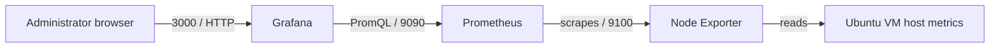

# Prometheus & Grafana Linux Monitoring

A hands-on DevOps portfolio project that monitors an Ubuntu 26.04 LTS VMware virtual machine with Prometheus, Node Exporter, and Grafana. Everything is installed manually with native Linux packages and `systemd` services—no Docker, Kubernetes, or Compose.

> **Project status:** Phase 2 complete — Prometheus 3.11.3 is installed, managed by `systemd`, and self-scraping on port 9090. Node Exporter is next.

## What this project demonstrates

- Linux administration, users, groups, ownership, permissions, and services
- Networking fundamentals: IP addresses, ports, listeners, and browser access
- Prometheus collection, storage, targets, and PromQL queries
- Node Exporter host metrics
- Grafana data sources, dashboards, panels, and dashboard export
- Careful Git documentation and repeatable troubleshooting

## Target architecture



All three services will initially run on the same Ubuntu VM. The design still uses their real network endpoints, so it can later be expanded to monitor additional servers.

## Planned repository layout

```text
Prometheus-Grafana-Monitoring/
├── README.md
├── LICENSE
├── .gitignore
├── prometheus.yml                 # Version-controlled Prometheus configuration
├── docs/
│   ├── phase-0-planning.md
│   ├── installation.md
│   ├── architecture.md             # Completed with verified details in Phase 6
│   ├── troubleshooting.md
│   ├── interview-questions.md      # Completed in Phase 7
│   └── commands.md
├── screenshots/                    # PNG/JPG evidence only; never credentials
└── dashboards/                     # Exported Grafana dashboard JSON
└── systemd/
    └── prometheus.service           # Version-controlled service unit
```

## Technology choices

| Component | Role | Default port |
| --- | --- | --- |
| Ubuntu 26.04 LTS VMware VM | Linux system being monitored | — |
| Node Exporter | Exposes host metrics in Prometheus format | `9100` |
| Prometheus | Scrapes and stores time-series metrics | `9090` |
| Grafana | Visualizes metrics with dashboards | `3000` |
| systemd | Starts, stops, restarts, and supervises services | — |

## Phased learning roadmap

1. **Phase 0 — Planning and Git foundation**: repository, scope, VM plan, and Git workflow.
2. **Phase 1 — Ubuntu foundation**: installation, network checks, updates, Linux basics, permissions, and systemd. **Complete.**
3. **Phase 2 — Prometheus**: native installation, least-privilege user, directories, configuration, and service. **Complete.**
4. **Phase 3 — Node Exporter**: install it as a system service and validate host metrics.
5. **Phase 4 — Scraping**: configure and reload Prometheus, inspect targets, and introduce alert-rule concepts.
6. **Phase 5 — Grafana**: native installation, secure first login, data source, dashboard, panels, and export.
7. **Phase 6 — Portfolio polish**: screenshots, diagrams, troubleshooting, and repository cleanup.
8. **Phase 7 — Interview practice**: explain every component and practise viva questions.

## Evidence standards

- Record the Ubuntu release, VM IP address, and package/software versions used. This lab uses a GUI-enabled Ubuntu 26.04 LTS VM; the monitoring services remain native `systemd` services.
- Verify each service with `systemctl`, its local metrics or web endpoint, and Prometheus/Grafana UI where appropriate.
- Never commit passwords, tokens, private IPs from a sensitive environment, downloaded archives, generated databases, or logs.
- Add screenshots only after obscuring passwords, tokens, personal information, and public IP addresses if relevant.

## Getting started

Read [the Phase 0 plan](docs/phase-0-planning.md) before changing the Ubuntu VM. At the end of each phase, commit only the files and screenshots created in that phase.

## License

This repository uses the MIT License. Before making the repository public, replace the placeholder copyright holder in [LICENSE](LICENSE).
