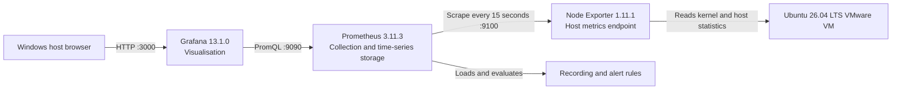

# Verified architecture

## Overview

This lab monitors one GUI-enabled Ubuntu 26.04 LTS VMware virtual machine. Prometheus, Node Exporter, and Grafana run natively on the same VM as managed `systemd` services. Docker, Kubernetes, and Compose are deliberately not used.

## Components and responsibilities

| Component | Responsibility | Endpoint | Service account |
| --- | --- | --- | --- |
| Node Exporter | Exposes CPU, memory, disk, filesystem, and network metrics in Prometheus format. | `:9100/metrics` | `node_exporter` |
| Prometheus | Scrapes endpoints every 15 seconds, stores time series, evaluates rules, and serves PromQL. | `:9090` | `prometheus` |
| Grafana | Queries Prometheus and presents the Linux Server Monitoring dashboard. | `:3000` | `grafana` |
| systemd | Starts services at boot, supervises their processes, and centralises their logs. | n/a | `root` manages units |

## Configuration and runtime locations

| Item | Version-controlled copy | Active VM location |
| --- | --- | --- |
| Prometheus configuration | [`prometheus.yml`](../prometheus.yml) | `/etc/prometheus/prometheus.yml` |
| Alert and recording rules | [`rules/node-alerts.yml`](../rules/node-alerts.yml) | `/etc/prometheus/rules/node-alerts.yml` |
| Prometheus service unit | [`systemd/prometheus.service`](../systemd/prometheus.service) | `/etc/systemd/system/prometheus.service` |
| Node Exporter service unit | [`systemd/node_exporter.service`](../systemd/node_exporter.service) | `/etc/systemd/system/node_exporter.service` |
| Grafana dashboard | [`dashboards/linux-server-monitoring.json`](../dashboards/linux-server-monitoring.json) | Imported through the Grafana UI |

Prometheus stores its runtime database under `/var/lib/prometheus`. That changing data is intentionally excluded from Git; Git stores the configuration needed to recreate the stack, not its collected metric history.

## Data flow

1. Node Exporter reads host statistics and exposes them at `http://localhost:9100/metrics`.
2. Prometheus scrapes that endpoint every 15 seconds and adds the `job=node_exporter` and `environment=lab` labels.
3. Prometheus evaluates the recording rule and alert rules from `/etc/prometheus/rules/node-alerts.yml` every 15 seconds.
4. Grafana connects server-side to `http://localhost:9090`, runs PromQL queries, and renders the dashboard in a browser on port `3000`.

The `NodeExporterDown` and `HostHighCPUUsage` rules are visible in Prometheus. This lab does not include Alertmanager, so firing alerts do not send email or chat notifications.

## Final verification

The stack was verified on 14 July 2026 with the following results:

| Check | Result |
| --- | --- |
| `prometheus`, `node_exporter`, and `grafana-server` service state | All `active` |
| Boot configuration for all three services | All `enabled` |
| Prometheus readiness endpoint | `Prometheus Server is Ready.` |
| Grafana health endpoint | Database status `ok`, Grafana `13.1.0` |
| Prometheus `up` query | `prometheus=1` and `node_exporter=1` |

`up=1` is important: it proves that Prometheus, not just the Node Exporter process, can reach and scrape each configured target successfully.

## Security and operational decisions

- Prometheus and Node Exporter run as dedicated, non-login service accounts rather than as the interactive user.
- Prometheus configuration and rule files are readable by the Prometheus group while remaining owned by `root`.
- Systemd unit files use service hardening options appropriate to the lab.
- Grafana credentials, API keys, logs, runtime databases, and downloaded archives are not committed.
- The VM uses private NAT networking. The VM address is not treated as a permanent public endpoint and may change after network changes or reboot.

## Known lab boundaries and future improvements

- All components run on one VM; a production deployment would usually separate Prometheus and Grafana from the monitored hosts.
- No Alertmanager is configured, so alerts remain visible in Prometheus only.
- HTTP is used inside the isolated lab. Production deployments should place Grafana behind HTTPS and restrict access with firewall rules or a reverse proxy.
- The dashboard is an imported community dashboard. A next iteration could add custom panels for the project’s recording rule and alert status.
