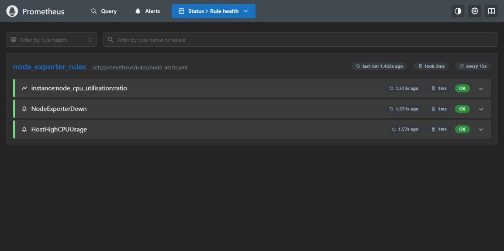

# Installation guide

## Phase 1 — Ubuntu host foundation

### Verified lab environment

| Item | Verified value |
| --- | --- |
| Virtualization | VMware Virtual Platform |
| Operating system | Ubuntu 26.04 LTS (Resolute Raccoon) |
| Kernel at verification | `7.0.0-27-generic` |
| Hostname | `sid-VMware-Virtual-Platform` |
| Administrator account | `sid` |
| Network interface | `ens33` |
| VM address at verification | `192.168.169.131/24` |
| Default gateway | `192.168.169.2` |

This is a GUI-enabled Ubuntu VM, as shown by the active GNOME session during reboot. That is suitable for this learning lab, though a minimal Ubuntu Server installation uses fewer resources. Prometheus, Node Exporter, and Grafana will still be installed as native Linux services and managed with `systemd`.

### What was verified

1. The VM has an IPv4 address and a default route.
2. Internet connectivity and DNS resolution work.
3. Ubuntu package metadata was refreshed before upgrades were applied.
4. The VM rebooted successfully after updates.
5. The administrator account has `sudo` access.
6. Linux ownership and permissions were practised with a `640` file.
7. `systemd` is PID 1, `systemd-journald` is active, and no units were failed.

### Why this phase comes first

Prometheus is a long-running service. Before adding one, confirm that the base operating system can resolve names, reach package repositories, accept administrative changes, preserve permissions, and report service health. Otherwise a monitoring installation can fail for reasons unrelated to Prometheus.

### Package update sequence

```bash
sudo apt update
sudo apt upgrade --dry-run
sudo apt upgrade
```

`apt update` refreshes the locally cached list of available packages. The dry run previews changes without installing them. `apt upgrade` applies the approved updates. After an upgrade, use `/var/run/reboot-required` to determine whether a reboot is requested.

### Correcting a stale third-party repository

The VM contained a Grafana repository before Grafana was intentionally installed. Its signing key was unavailable, so `apt update` stopped with `NO_PUBKEY 963FA27710458545`. The source was safely disabled by renaming:

```text
/etc/apt/sources.list.d/archive_uri-https_packages_grafana_com_oss_deb-resolute.list
```

to:

```text
/etc/apt/sources.list.d/archive_uri-https_packages_grafana_com_oss_deb-resolute.list.disabled
```

The file was preserved rather than deleted. Grafana will be added later in Phase 5 with its official, current signing-key procedure.

### Permissions result

The `sid` home directory has mode `750` (`drwxr-x---`). The learning file `/home/sid/devops-lab/phase-1/permissions-demo.txt` has mode `640` (`-rw-r-----`): owner read/write, group read, and no access for others.

This illustrates least privilege. The monitoring services will receive their own non-login accounts and only the directory access they need.

### systemd result

`systemd` is process ID 1. `systemd-journald.service` is active and socket-activated. A unit shown as `static` is not broken; it means the unit is started by another unit rather than enabled directly at boot. `systemctl --failed` returned zero failed units.

## Phase 2 — Prometheus installation

### Installed version and source

Prometheus `3.11.3` for `linux/amd64` was downloaded from the official Prometheus GitHub release. The architecture matches the VM’s `x86_64` CPU. Before extraction, the archive was verified with the release’s `sha256sums.txt` file and `sha256sum -c`.

The release archive itself is not committed to Git because it is a large third-party binary. The exact configuration and service unit are committed instead.

### Least-privilege layout

| Path or account | Owner and mode | Purpose |
| --- | --- | --- |
| `prometheus` system account | non-login account | Runs the service without administrator privileges. |
| `/usr/local/bin/prometheus` | `root:root`, `0755` | Prometheus server binary. |
| `/usr/local/bin/promtool` | `root:root`, `0755` | Configuration validation utility. |
| `/etc/prometheus/prometheus.yml` | `root:prometheus`, `0640` | Service configuration. |
| `/var/lib/prometheus` | `prometheus:prometheus`, `0750` | Time-series database and write-ahead log. |
| `/etc/systemd/system/prometheus.service` | root-owned systemd unit | Starts and supervises Prometheus. |

### Service behaviour

The service waits for `network-online.target`, runs as `prometheus`, stores data only in `/var/lib/prometheus`, restarts after failure, and starts automatically on boot. It listens on `0.0.0.0:9090`, allowing the Windows host to reach the VM’s web UI over the VMware NAT network.

The unit uses `NoNewPrivileges`, `PrivateTmp`, `ProtectSystem`, and `ProtectHome` as basic hardening. Configuration reloads use `systemctl reload prometheus`, which sends `SIGHUP`; no HTTP lifecycle administration endpoint is exposed.

### Verification

The following checks passed:

```bash
systemctl is-active prometheus
systemctl is-enabled prometheus
sudo ss -ltnp 'sport = :9090'
wget -qO- http://localhost:9090/-/ready
```

The Prometheus UI is available at `http://<VM-IP>:9090`. In **Status → Targets**, the `prometheus` job is `UP`. The PromQL query `up` returns `1`, which means the last scrape succeeded.

## Phase 3 — Node Exporter installation

### Purpose

Node Exporter reads Linux host information and exposes it in Prometheus metric format at `/metrics` on port `9100`. It does not send data to Prometheus. Prometheus pulls the endpoint every 15 seconds.

### Legacy installation audit and upgrade

The VM contained a pre-existing Node Exporter `1.9.1` installation. It was running, but the binary was owned by `nodeusr`, the service ran as `nodeusr`, and its unit used `default.target`. Before changing anything, the prior binary and unit were backed up.

Node Exporter `1.11.1` for `linux/amd64` was downloaded from the official release and verified against its `sha256sums.txt` checksum file. The replacement binary is installed at `/usr/local/bin/node_exporter` with `root:root` ownership and mode `0755`.

### Service design

`node_exporter.service` runs as the non-login `node_exporter` account, waits for the network to be ready, restarts after unexpected failure, and is enabled with `multi-user.target`. It listens on `0.0.0.0:9100`.

The unit uses `NoNewPrivileges`, `PrivateTmp`, `ProtectSystem`, and `ProtectHome`. Node Exporter needs read access to Linux system interfaces such as `/proc` and `/sys`, but it does not need root access or write access to user home directories.

### Prometheus scrape target

The version-controlled `prometheus.yml` now includes:

```yaml
- job_name: "node_exporter"
  static_configs:
    - targets:
        - "localhost:9100"
```

Because both programs run on one VM, `localhost:9100` is the correct target. In a multi-server deployment, replace `localhost` with the monitored host’s address or DNS name.

After `promtool` validated the configuration, Prometheus was reloaded with `systemctl reload prometheus`; it was not restarted. In **Status → Targets**, both `prometheus` and `node_exporter` are `UP`.

## Phase 4 — Scraping, recording rules, and alerts

### Scrape configuration

Prometheus loads two static targets every 15 seconds:

| Job | Target | Role |
| --- | --- | --- |
| `prometheus` | `localhost:9090` | Prometheus self-monitoring metrics. |
| `node_exporter` | `localhost:9100` | Linux host CPU, memory, filesystem, network, and other system metrics. |

A static target is written directly in `prometheus.yml`. This is suitable for the single-VM lab. Larger environments commonly use service discovery rather than manually listing every address.

### Rule configuration

`prometheus.yml` loads `/etc/prometheus/rules/*.yml`. The rule file is stored in the repository as `rules/node-alerts.yml` and installed as `/etc/prometheus/rules/node-alerts.yml` with `root:prometheus` ownership and `0640` mode.

The `node_exporter_rules` group runs every 15 seconds and contains three rules:

| Rule | Type | Meaning |
| --- | --- | --- |
| `instance:node_cpu_utilisation:ratio` | Recording | Stores non-idle CPU utilisation as a ratio from 0 to 1. |
| `NodeExporterDown` | Alert | Fires after Node Exporter cannot be scraped for two minutes. |
| `HostHighCPUUsage` | Alert | Fires after CPU usage exceeds 85% for five minutes. |

A recording rule precomputes a query, making repeated dashboard queries simpler and usually faster. An alerting rule changes state from inactive to pending and then firing. These alerts are visible in Prometheus, but no Alertmanager is configured, so no email, chat, or other notification is sent.

### Safe configuration workflow

Every Prometheus configuration change follows this sequence:

```bash
sudo -u prometheus promtool check rules /etc/prometheus/rules/node-alerts.yml
sudo -u prometheus promtool check config /etc/prometheus/prometheus.yml
sudo systemctl reload prometheus
```

Validation happens as the restricted service account. Only after both checks pass is Prometheus reloaded. A reload sends the process a signal to read the configuration again; it does not discard the in-memory service or stored time-series data.

### Verification evidence

The Prometheus **Rule health** page shows all three rules in the `node_exporter_rules` group with an `OK` evaluation result, running every 15 seconds.


